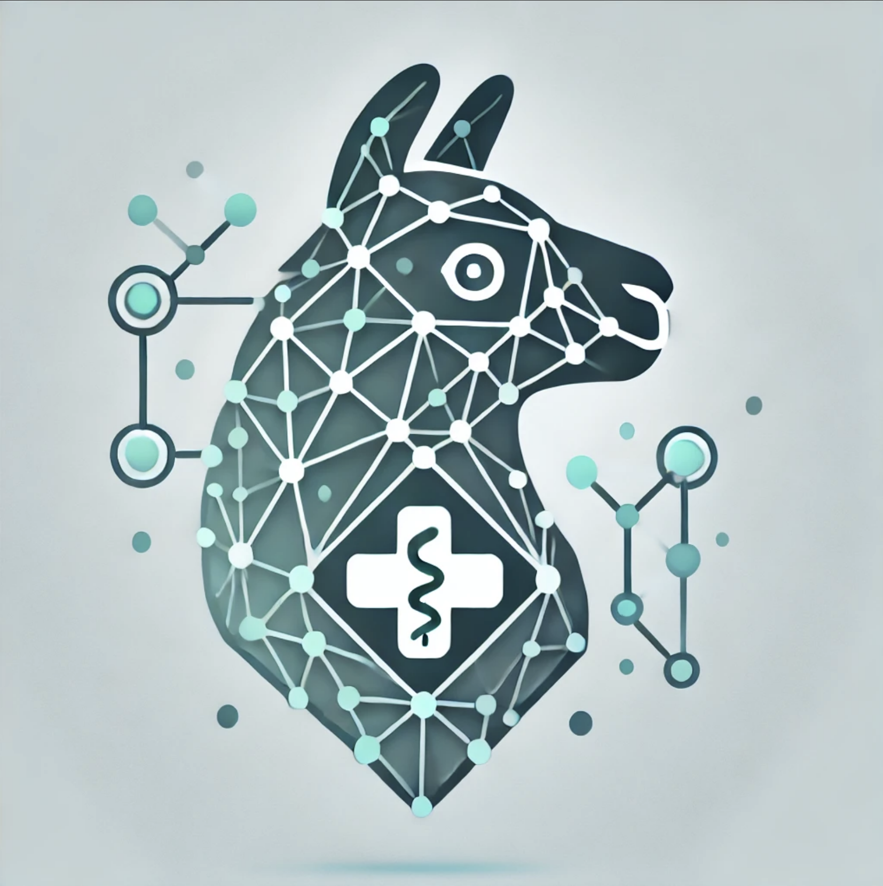
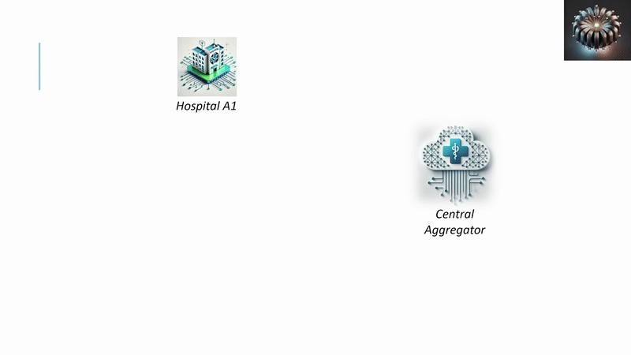
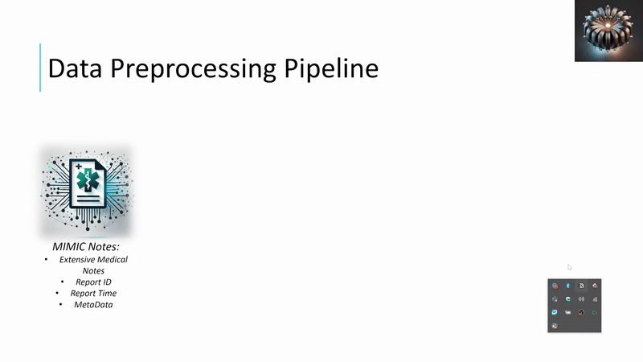

# Federated Finetuning with LLaMA

<p align="center">
  
</p>

This repository demonstrates a modular, distributed, federated learning (FL) approach for finetuning a LLaMA model using PyTorch and Hugging Face libraries. The training leverages 8 GPUs (each acting as an FL client) and includes 4-bit quantization and LoRA adapter techniques.

<p align="center">
  
</p>


## Repository Structure

- **env.yml**  
  The Conda environment file that lists all dependencies required to run the code.

- **README.md**  
  This file. It contains detailed instructions on how to set up and run the project.

- **main.py**  
  The entry point of the application. It uses `argparse` to parse command-line arguments, sets necessary environment variables, and spawns distributed processes for local training.

- **federated.py**  
  Contains the core function `local_train` that runs on each GPU. This script:
  - Initializes the NCCL process group.
  - Loads and partitions the dataset.
  - Loads the model (with 4-bit quantization and LoRA).
  - Sets up the trainer and performs local training rounds.
  - Implements federated averaging across the clients.
  
- **utils.py**  
  Includes helper functions:
  - `append_loss_to_file`: Append training/evaluation losses to a JSON file.
  - `partition_dataset`: Evenly partitions the dataset among FL clients.
  - `federated_average`: Performs averaging on trainable parameters (LoRA weights).
  - `convert_squad_sample_to_llama_conversation`: Converts dataset samples into the conversation format expected by LLaMA.

<p align="center">
  
</p>

## Setting Up the Environment

1. **Clone the Repository:**

   ```bash
   git clone https://your.repo.url/federated-llama.git
   cd federated-llam
   ```

2. **Ensure you have Conda installed, then run:**

    ```bash
    conda env create -f env.yml
    conda activate federated-env
    ```

## Running the Code

The main entry point is `main.py`, which accepts various command-line arguments to configure the training. Here are some of the key parameters you can set:

- **world_size**: Number of GPUs to use (FL participants); default is 8.
- **num_rounds**: Number of federated rounds.
- **local_steps**: Number of local training steps per federated round.
- **dataset_path**: Path to your dataset.
- **model_name**: Hugging Face model name (for example, `"meta-llama/Llama-3.1-8B-Instruct"`).
- **hf_token**: Your Hugging Face authentication token.
- **output_dir**: Directory where models and logs will be saved.

### Example Usage

After activating the Conda environment, run the training by invoking the `main.py` script with the desired parameters. For example, you can run the script with arguments that specify the number of GPUs, federated rounds, local training steps, dataset location, model name, Hugging Face token, and output directory. Adjust these parameters as needed for your experiment.

```bash
python main.py --world_size 8 --num_rounds 200 --local_steps 1 \
    --dataset_path "/path/to/your/dataset" --model_name "meta-llama/Llama-3.1-8B-Instruct" \
    --hf_token "your_hf_token" --output_dir "./model"
```

## How the Code Works

1. **main.py**  
   - **Argument Parsing:**  
     Uses the `argparse` module to read configuration parameters from the command line.
   - **Environment Setup:**  
     Sets essential distributed training variables (such as `MASTER_ADDR`, `MASTER_PORT`, `NCCL_*` variables, and disables wandb logging).
   - **Process Spawning:**  
     Uses `torch.multiprocessing.spawn` to start a separate process for each GPU. Each process executes the `local_train` function from `federated.py`.

2. **federated.py**  
   - **Initialization:**  
     Each spawned process sets its CUDA device and initializes the NCCL process group.
   - **Dataset Handling:**  
     Loads the dataset (using Hugging Face’s `load_dataset`) and partitions it evenly among clients with the help of the `partition_dataset` function.
   - **Model Loading and Preparation:**  
     Loads the LLaMA model with 4-bit quantization (using `BitsAndBytesConfig`), and applies LoRA adapters with `prepare_model_for_kbit_training` and `LoraConfig`.
   - **Training Setup:**  
     Configures training parameters using `TrainingArguments` and initializes the `SFTTrainer`. Different evaluation datasets are used on rank 0 versus other processes.
   - **Federated Learning Rounds:**  
     In each round:
       - Local training is executed.
       - A barrier synchronizes all GPUs.
       - Federated averaging is performed across all trainable parameters.
       - Evaluation results are logged and, if on rank 0, the global model is saved.
   - **Cleanup:**  
     Destroys the NCCL process group after training is complete.

3. **utils.py**  
   - Provides helper functions to handle tasks such as logging losses to JSON files, partitioning the dataset, averaging model parameters across clients, and converting dataset samples to the expected conversation format.

## Additional Notes

- **NCCL Debugging:**  
  The script sets several NCCL environment variables (e.g., `NCCL_BLOCKING_WAIT`, `NCCL_LAUNCH_TIMEOUT`, and `NCCL_DEBUG`) to ensure robust communication between GPUs. Adjust these values if you encounter communication or timeout issues.

- **Deprecation Warnings:**  
  Some libraries might display warnings regarding deprecated arguments (for example, the use of `tokenizer` in the trainer). These warnings are informational. It is advisable to update your code as new versions of the libraries are released.

- **Customization:**  
  The code is designed to be modular. You can easily modify or extend it by adding additional command-line arguments, improving logging mechanisms, or integrating other federated learning strategies.

## Troubleshooting

- **Process Synchronization:**  
  If you encounter NCCL timeouts or synchronization errors, consider reducing the local training workload (e.g., lower the `local_steps` or batch sizes) or adjusting the NCCL environment variables.

- **Data Imbalance:**  
  Verify that your dataset is partitioned evenly across clients using the provided `partition_dataset` function.

- **GPU Utilization:**  
  Use monitoring tools to ensure that all GPUs are utilized as expected. Imbalances might indicate issues with data loading or workload distribution.


<p align="center">
  
</p>